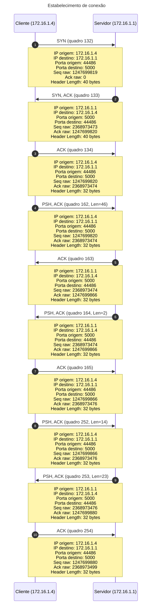

```mermaid
---
title: Estabelecimento de conexão
---

sequenceDiagram
    autonumber
    participant PC4 as Cliente (172.16.1.4)
    participant PC1 as Servidor (172.16.1.1)

    PC4->>PC1: SYN (quadro 132)
    Note over PC4,PC1: IP origem: 172.16.1.4<br/>IP destino: 172.16.1.1<br/>Porta origem: 44486<br/>Porta destino: 5000<br/>Seq raw: 1247699819<br/>Ack raw: 0<br/>Header Length: 40 bytes

    PC1->>PC4: SYN, ACK (quadro 133)
    Note over PC4,PC1: IP origem: 172.16.1.1<br/>IP destino: 172.16.1.4<br/>Porta origem: 5000<br/>Porta destino: 44486<br/>Seq raw: 2368973473<br/>Ack raw: 1247699820<br/>Header Length: 40 bytes

    PC4->>PC1: ACK (quadro 134)
    Note over PC4,PC1: IP origem: 172.16.1.4<br/>IP destino: 172.16.1.1<br/>Porta origem: 44486<br/>Porta destino: 5000<br/>Seq raw: 1247699820<br/>Ack raw: 2368973474<br/>Header Length: 32 bytes

    PC4->>PC1: PSH, ACK (quadro 162, Len=46)
    Note over PC4,PC1: IP origem: 172.16.1.4<br/>IP destino: 172.16.1.1<br/>Porta origem: 44486<br/>Porta destino: 5000<br/>Seq raw: 1247699820<br/>Ack raw: 2368973474<br/>Header Length: 32 bytes

    PC1->>PC4: ACK (quadro 163)
    Note over PC4,PC1: IP origem: 172.16.1.1<br/>IP destino: 172.16.1.4<br/>Porta origem: 5000<br/>Porta destino: 44486<br/>Seq raw: 2368973474<br/>Ack raw: 1247699866<br/>Header Length: 32 bytes

    PC1->>PC4: PSH, ACK (quadro 164, Len=2)
    Note over PC4,PC1: IP origem: 172.16.1.1<br/>IP destino: 172.16.1.4<br/>Porta origem: 5000<br/>Porta destino: 44486<br/>Seq raw: 2368973474<br/>Ack raw: 1247699866<br/>Header Length: 32 bytes

    PC4->>PC1: ACK (quadro 165)
    Note over PC4,PC1: IP origem: 172.16.1.4<br/>IP destino: 172.16.1.1<br/>Porta origem: 44486<br/>Porta destino: 5000<br/>Seq raw: 1247699866<br/>Ack raw: 2368973476<br/>Header Length: 32 bytes

    PC4->>PC1: PSH, ACK (quadro 252, Len=14)
    Note over PC4,PC1: IP origem: 172.16.1.4<br/>IP destino: 172.16.1.1<br/>Porta origem: 44486<br/>Porta destino: 5000<br/>Seq raw: 1247699866<br/>Ack raw: 2368973476<br/>Header Length: 32 bytes

    PC1->>PC4: PSH, ACK (quadro 253, Len=23)
    Note over PC4,PC1: IP origem: 172.16.1.1<br/>IP destino: 172.16.1.4<br/>Porta origem: 5000<br/>Porta destino: 44486<br/>Seq raw: 2368973476<br/>Ack raw: 1247699880<br/>Header Length: 32 bytes

    PC4->>PC1: ACK (quadro 254)
    Note over PC4,PC1: IP origem: 172.16.1.4<br/>IP destino: 172.16.1.1<br/>Porta origem: 44486<br/>Porta destino: 5000<br/>Seq raw: 1247699880<br/>Ack raw: 2368973499<br/>Header Length: 32 bytes
```
